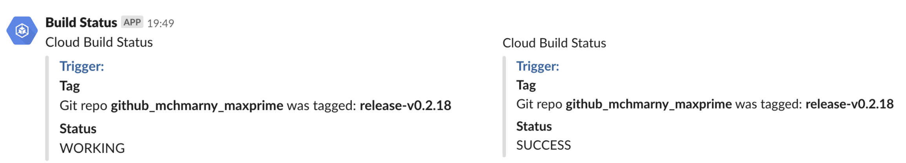

# buildstatus

Simple Cloud Build status notification based on status changes published by Cloud Build to Cloud PubSub topic.



This sample uses [Cloud Build](https://cloud.google.com/cloud-build/) and [Cloud Run](https://cloud.google.com/run/) GCP service. The full end-to-end demo showcasing continuous deployment test, build, and deployment see [knative-gitops-using-cloud-build](https://github.com/mchmarny/knative-gitops-using-cloud-build).

## Setup

We will start by capturing a few configuration values required to deploy and configuring the notification service, Project name and ID:

```shell
PRJ=$(gcloud config get-value project)
PRJ_NUM=$(gcloud projects describe ${PRJ} --format 'value(projectNumber)')
```

In addition to the above, we also need a couple of Slack API configuration parameters. See this how to for more details on [Creating API tokens](https://get.slack.help/hc/en-us/articles/215770388-Create-and-regenerate-API-tokens):

```shell
SLACK_API_TOKEN=
# this is the ID of the channel, not its name
SLACK_BUILD_STATUS_CHANNEL=
```

## Service Deploy

Once you define the above variables, you can deploy the prebuilt image to Cloud Run using this command:

> To avoid storing sensitive data in environment variables consider using something like [berglas](https://github.com/GoogleCloudPlatform/berglas)

```shell
gcloud beta run deploy cloud-build-status \
  --image=gcr.io/cloudylabs-public/cloud-build-status:0.1.2 \
  --region us-central1 \
  --set-env-vars=SLACK_API_TOKEN=$SLACK_API_TOKEN,SLACK_BUILD_STATUS_CHANNEL=$SLACK_BUILD_STATUS_CHANNEL
```

When prompted to `allow unauthenticated` select "N" for No. That will set that service private so that we can use service account later to enable PubSub to "push" evens to this service.

## Service Authorization

Because we want Cloud Run to only process events pushed from Cloud PubSub, we will need to enable our project to create Cloud Pub/Sub authentication tokens:

```shell
gcloud projects add-iam-policy-binding $PRJ \
 --member="serviceAccount:service-${PRJ_NUM}@gcp-sa-pubsub.iam.gserviceaccount.com"\
 --role='roles/iam.serviceAccountTokenCreator'
```

Then, we will create a service account (`build-notif-sa`) that will be used by PubSub to invoke our Cloud Run service:

```shell
gcloud iam service-accounts create build-notif-sa \
  --display-name "Cloud Run Notification Service Invoker"
```

Finally, we can create a policy binding for that service account to access our Cloud Run service:

```shell
gcloud beta run services add-iam-policy-binding cloud-build-status \
	--member=serviceAccount:build-notif-sa@${PRJ}.iam.gserviceaccount.com \
	--role=roles/run.invoker
```

## PubSub Subscription

Since Cloud Run generates service URL which includes random portion of the service name, we will start by capturing the full service URL:

```shell
SURL=$(gcloud beta run services describe cloud-build-status --region us-central1 --format 'value(status.url)')
```

Now, to enable PubSub to push data to Cloud Run service we will create a PubSub topic subscription called `cloud-builds-sub` for the `cloud-builds` topic to which Cloud Build publishes status changes:

```shell
gcloud beta pubsub subscriptions create cloud-builds-sub \
	--topic cloud-builds \
	--push-endpoint="${SURL}/" \
	--push-auth-service-account="build-notif-sa@${PRJ}.iam.gserviceaccount.com"
```

## Slack

That's it. If everything goes well, you should see notifications in Slack for each one of the Cloud Build status changes resulting from build trigger (e.g. `WORKING`, `SUCCESS`, `FAILURE`, `INTERNAL_ERROR`, `TIMEOUT`).

## Log & Metrics

You can also view the `cloud-build-status` service log to see the raw data that was pushed by PubSub subscription to the service and the processed data that was pushed onto the target topic.

Additionally, in Stackdriver, you can also monitor the Cloud PubSub subscription and Cloud Run metrics.

## Disclaimer

This is my personal project and it does not represent my employer. I take no responsibility for issues caused by this code. I do my best to ensure that everything works, but if something goes wrong, my apologies is all you will get.
